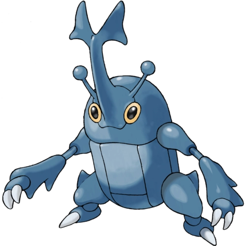

<!-- ![Modern C++ template][github-sub-title:img] -->

 
 
 

 <!--  -->
    
    
    
    
    

 

<!-- [github-sub-title:img]: https://readme-typing-svg.herokuapp.com?font=Segoe+Script&center=true&lines=mq白. -->
